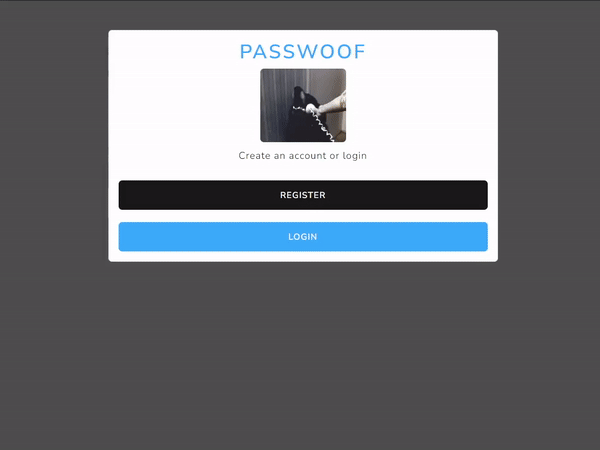

# PassWoof

A login authorization/authentication mini project utilizing EJS, Node/Express & MongoDB  
---

    

Practise project to design a fully functional registration process, with login validation, sanitized input and password hashing using bcrypt.
